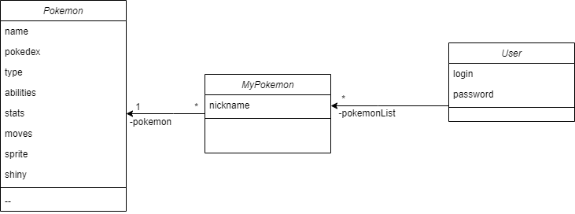
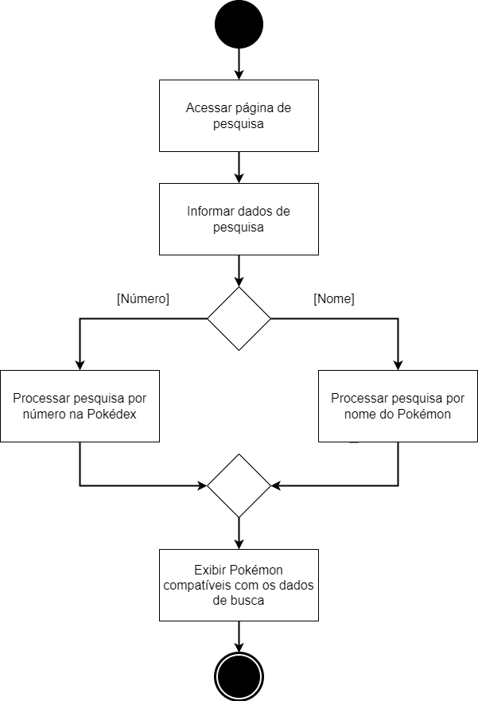

# $${\color{red}P \color{orange}o \color{yellow}Q \color{green}u \color{blue}e \color{purple}e \color{gray}r \color{brown}D \color{lightblue}e \color{pink}x}$$

## Escopo do sistema:
Os jogos eletrônicos da franquia Pokémon tem conquistado um público vasto e apaixonado ao longo dos anos, demonstrando seu apelo universal. O gerenciamento de times de Pokémon desempenha um papel crucial na estratégia dos jogadores que desejam participar de torneios de batalhas online e que almejam elevar a sua experiência de jogo.
O sistema desenvolvido oferece uma plataforma intuitiva para que os jogadores possam organizar e gerenciar seus times de batalha de forma eficaz. Com a capacidade de cadastrar até seis Pokémon em um time, os usuários podem criar estratégias para enfrentar desafios diversos oferecidos pelo catálogo de jogos da franquia.

## Funcionalidades Principais:
- Cadastro de Pokémon:
  - Os usuários podem adicionar Pokémon ao seu time através da nossa integração com a API pokéAPI. Basta especificar o nome ou número do Pokémon desejado, e o sistema irá recuperar automaticamente os dados relevantes, como tipo, habilidades e estatísticas.
- Cadastro de Times:
  - Os usuários podem elaborar diversos times que podem ter focos em diferentes estratégias que serão armazenados em um banco de dados.
- Gerenciamento do Time:
  - Os usuários podem facilmente adicionar e remover Pokémon de um time conforme desejado. Isso permite ajustes dinâmicos para otimizar a composição do time para diferentes situações de batalha.
- Visualização de Informações dos Pokémon:
  - Os usuários podem acessar informações detalhadas sobre cada Pokémon, incluindo estatísticas base, movimentos, fraquezas e resistências. Isso ajuda na elaboração de estratégias eficazes de batalha.

## Membros da equipe e papéis:
- [Juan Marcos Braga Faria](https://github.com/juanmfaria) - Backend
- [Kaique Oliveira](https://github.com/kaiqueoliveir0) - Frontend
- [Lucas Almeida Santos de Souza](https://github.com/zzzluquinhas) - Fullstack
- [Rodrigo Sales Nascimento](https://github.com/rodrigo-salesn) - Backend

## Tecnologias:
- API pokéAPI para coletar informações dos pokémon existentes no jogo.
- HTML, CSS e Javascript para frontend
- Firebase como banco de dados noSQL
- Python para integração dos componentes

## User Stories:
1. Como usuário, eu gostaria de saber mais sobre um pokémon específico.
1. Como usuário, eu gostaria de ter uma conta na aplicação.
1. Como usuário, eu gostaria de adicionar/remover um pokémon à minha conta.
1. Como usuário, eu gostaria de nomear um pokémon que gosto muito.
1. Como usuário, eu gostaria de adicionar/remover um pokémon a um time novo.
1. Como usuário, eu gostaria de ordenar meus times por aqueles que mais uso/venci/"gosto".
1. Como usuário, eu gostaria de adicionar/remover um pokémon à minha lista de favoritos.
1. Como usuário, eu gostaria de colocar um pokémon novo num time já montado (substituir).
1. Como usuário, eu gostaria de sempre ver meus times favoritos primeiro na interface.
1. Como usuário, eu gostaria de nomear um time de pokémon.
1. Como usuário, eu gostaria de recuperar meu acesso caso esqueça a senha.
1. Como usuário, eu gostaria que as minhas credenciais de acesso fossem armazenadas de forma segura.
1. Como usuário, eu gostaria de remover um Pokémon da minha lista quando eu não o quiser mais.
1. Como administrador, eu gostaria que meus usuários não coloquem senhas inseguras.

## Sprint backlog:
História 1: Como usuário, eu gostaria de saber mais sobre um pokémon específico.

Tarefas e responsáveis:
- Definir classe “Pokémon” com informações mais relevantes para a pokédex [Rodrigo]
- Construir lógica para requisição de dados da PokéAPI [Juan]
- Configurar mecanismo de busca [Lucas + Juan]
- Desenvolver tela inicial com caixa de busca [Lucas]
- Desenvolver tela com resultados da busca [Kaique]
- Desenvolver tela de exibição das informações de um Pokémon [Kaique]

História 2: Como usuário, eu gostaria de ter uma conta na aplicação.

Tarefas e responsáveis:
- Criar conta no banco Firebase [Lucas]
- Definir classe “Usuário” com informações de login, senha e lista de pokémon [Rodrigo]
- Mapear a classe “Usuário” no banco de dados [Juan]
- Desenvolver interface inicial de login do usuário [Lucas]
- Adicionar integração da interface de usuário à tela inicial (botão de login antes de entrar, nome depois de entrar) [Kaique]

História 3: Como usuário, eu gostaria de adicionar/remover um pokémon à minha conta.

Tarefas e responsáveis:
- Definir lista de pokémons para cada usuário no banco de dados [Juan]
- Mapear a classe “Pokemon” no banco de dados [Rodrigo]
- Desenvolver tela para exibição de lista de pokémon de cada usuário [Kaique]
- Desenvolver “menu de adição” de um pokémon à lista (para adicionar atributos como nickname) [Kaique]
- Adicionar à tela de exibição de um pokémon uma integração para adicionar o pokémon [Lucas]
- Adicionar à tela de resultados de busca uma integração para adicionar o pokémon [Lucas]

História 4: Como usuário, eu gostaria de nomear um pokémon que gosto muito.

Tarefas e responsáveis:
- Definir método que permite mudar o nome de um pokémon da lista de um usuário [Rodrigo]
- Criar um botão no pokémon do usuário para alterar o nome [Kaique]
- Adicionar integração do método de mudança de nome na interface de exibição das informações de um pokémon na lista de um usuário [Kaique]

## Versão Revisada do Backlog da Sprint:

História 1: Como usuário, eu gostaria de ter uma conta na aplicação.

Tarefas e responsáveis:
- Criar conta no banco de dados Firebase [Lucas]
- Configurar credencias para acesso ao banco [Lucas]
- Mapear a classe “Usuário” no banco de dados [Juan]
- Implementar a configuração base de uma API Flask [Rodrigo]
- Implementar endpoints com métodos de comunicação com o banco de dados para salvar e buscar usuários [Rodrigo]
- Padronizar métodos de acesso com o mapeamento feito no banco [Juan]
- Desenvolver interface inicial de login do usuário [Lucas]
- Adicionar integração da interface de usuário à tela inicial (botão de login antes de entrar, nome depois de entrar) [Kaique]
- Configurar integração da interface de usuário com a API Flask [Kaique]

História 2: Como usuário, eu gostaria de saber mais sobre um pokémon específico.

Tarefas e responsáveis:
- Desenvolver lógica para requisição de dados da PokéAPI [Juan + Rodrigo]
- Mapear informações de um pokémon que serão usadas no sistema [Rodrigo]
- Configurar mecanismos de busca [Lucas + Juan]
- Desenvolver tela inicial com caixa de busca [Lucas]
- Desenvolver tela com resultados da busca [Kaique]
- Desenvolver tela de exibição das informações de um Pokémon [Kaique]

História 3: Como usuário, eu gostaria de adicionar um pokémon à minha conta.

Tarefas e responsáveis:
- Mapear a classe “MyPokemon” no banco de dados [Rodrigo]
- Implementar endpoints com métodos de comunicação com o banco de dados para salvar e buscar pokémon de um usuário [Juan]
- Desenvolver tela para exibição de lista de pokémon de cada usuário [Kaique]
- Adicionar à tela de exibição de informações de um pokémon um botão para adicionar o pokémon a lista do usuário [Lucas]
- Configurar integração das interfaces desenvolvidas com a API Flask [Kaique + Lucas]

História 4: Como usuário, eu gostaria de nomear um pokémon que gosto muito.

Tarefas e responsáveis:
- Implementar endpoint com método de comunicação com o banco de dados para salvar o nickname do pokémon de um usuário [Rodrigo + Juan]
- Criar um botão na tela de informações do pokémon do usuário para alterar o nickname [Kaique]
- Configurar integração das interfaces desenvolvidas com a API Flask [Kaique + Lucas]

## Diagramas UML

### Diagrama de Classe

### Diagrama de Atividades

Diagrama que demonstra o processo de pesquisa de pokémon. 

